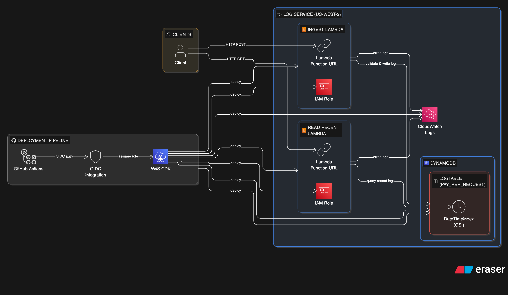

# Log Service

A serverless log ingestion and retrieval service built on AWS, deployed via AWS CDK (Python).

## Architecture



**Components:**
- **DynamoDB** — `LogTable` with `DateTimeIndex` GSI for time-sorted queries (PAY_PER_REQUEST)
- **Ingest Lambda** — validates and stores log entries via HTTP POST
- **Read Recent Lambda** — retrieves the 100 most recent log entries via HTTP GET
- **Lambda Function URLs** — direct HTTP endpoints (no API Gateway)

## Log Entry Format

```json
{
  "id": "550e8400-e29b-41d4-a716-446655440000",
  "dateTime": "2026-02-09T21:50:20.846154+00:00",
  "severity": "info | warning | error",
  "message": "Your log message here"
}
```

- `id` — auto-generated UUID if not provided
- `dateTime` — auto-set to current UTC time if not provided
- `severity` — **required**, one of: `info`, `warning`, `error`
- `message` — **required**, free-text log content

## Prerequisites

- Python 3.12+
- Node.js 20+ (for AWS CDK CLI)
- AWS CLI configured with appropriate credentials
- AWS CDK CLI (`npm install -g aws-cdk`)

## Local Development

```bash
# Create and activate virtual environment
python3 -m venv .venv
source .venv/bin/activate

# Install dependencies
pip install -r requirements.txt

# Synthesize CloudFormation template (validates stack)
cdk synth

# View pending changes
cdk diff --profile <your-profile>

# Deploy
cdk deploy --profile <your-profile>

# Destroy
cdk destroy --profile <your-profile>
```

## CI/CD

Automated via GitHub Actions:

| Trigger | Workflow | Action |
|---------|----------|--------|
| PR to `main` | `ci.yml` | `cdk synth` + `cdk diff` (posts diff as PR comment) |
| Push to `main` | `deploy.yml` | `cdk deploy` to production |

**Credential security:** AWS authentication uses OIDC federation — GitHub Actions assumes an IAM role directly. No static AWS keys are stored as secrets.

## Branching Strategy

Trunk-based development with conventional commits:

- `main` — production; deploys on merge
- `feat/<slug>` — new features
- `fix/<slug>` — bug fixes
- `chore/<slug>` — maintenance/infra
- `refactor/<slug>` — restructuring

Commit format: `type(scope): description`

## Deploy & Test

After deploying (`cdk deploy --profile <your-profile>`), the stack outputs both Function URLs. Save them as environment variables:

```bash
export INGEST_URL="<IngestFunctionUrl from cdk deploy output>"
export READ_URL="<ReadRecentFunctionUrl from cdk deploy output>"
```

**Create a log entry:**

```bash
curl -X POST $INGEST_URL \
  -H "Content-Type: application/json" \
  -d '{"severity":"info","message":"Hello world"}'
```

**Read recent logs:**

```bash
curl $READ_URL
```

**Test validation (missing fields):**

```bash
curl -X POST $INGEST_URL \
  -H "Content-Type: application/json" \
  -d '{}'
```

**Test all severity levels:**

```bash
curl -X POST $INGEST_URL \
  -H "Content-Type: application/json" \
  -d '{"severity":"warning","message":"Disk almost full"}'
```

```bash
curl -X POST $INGEST_URL \
  -H "Content-Type: application/json" \
  -d '{"severity":"error","message":"Connection failed"}'
```

## Database Choice: DynamoDB

**DynamoDB** was chosen over RDS/Aurora for the following reasons:

- Fully serverless — no VPC, no connection pooling, no cold-start delays
- Native IAM-based Lambda integration — no password management
- `PAY_PER_REQUEST` billing — automatic throughput scaling without manual capacity tuning, scales to zero cost when idle
- Millisecond read/write latency

**Trade-off:** Modeling for a sorted global "recent logs" view requires an additional access pattern (GSI), since DynamoDB does not support cross-partition ordering natively.

## Data Model

**Table: `LogTable`**

- Partition Key: `LogID` (String, UUID)
- Attributes: `DateTime`, `Severity`, `Message`, `LogType`

**GSI: `DateTimeIndex`** — enables efficient retrieval of the most recent logs across all entries:

- Partition Key: `LogType` (String, always `"LOG"`) — creates a single logical stream
- Sort Key: `DateTime` (String, ISO 8601)
- Projection: `ALL`

The Read Recent Lambda queries this GSI with `ScanIndexForward=False` and `Limit=100` to return the newest entries first.

**Trade-off:** Using a single fixed partition key (`LogType=LOG`) means all writes target one GSI partition. This works well for moderate workloads but becomes a hot partition at very high write rates (>1000 WCU/s). For production scale, consider sharding the partition key by time bucket (e.g. `LOG#2026-02-09`).

## Logging & CloudWatch Cost Controls

Both Lambda functions use Python's `logging` module and follow an **error-only event logging** pattern inspired by [alexwlchan's blog post](https://alexwlchan.net/2018/error-logging-in-lambdas/):

- The `handler()` wraps all logic in a try/except
- On **success**: no event data is logged — only the Lambda platform logs the invocation
- On **failure**: `logger.exception()` logs the full event payload and stack trace to CloudWatch

This avoids continuous high log volume from successful invocations while preserving full debuggability when errors occur.

## Function URL Exposure

Both Lambda Function URLs use `auth_type=NONE` (public access) as required for this demo.

**Trade-offs and risks:**

- No authentication means anyone with the URL can invoke the functions
- No rate limiting at the Lambda URL level — susceptible to abuse or denial-of-wallet attacks
- No CORS configuration currently applied

**Production hardening recommendations:**

- Switch to `auth_type=AWS_IAM` and use SigV4 signed requests
- Add AWS WAF in front of the endpoints for rate limiting and IP filtering
- Use API Gateway instead of Function URLs for richer auth, throttling, and usage plans
- Configure CORS headers if browser clients need access

## Known Security Concerns

The following are known limitations in the current implementation:

**Authentication (CWE-306):**
- Lambda Function URLs use `auth_type=NONE`, exposing both ingest and read endpoints publicly without authentication

**Crash risks:**
- Missing environment variable handling — both Lambda functions will fail immediately if `TABLE_NAME` is not set (no graceful fallback)
- DynamoDB operations lack explicit error handling for throttling, network failures, or missing GSI
- Missing field validation when transforming DynamoDB items in the read handler — a missing attribute will cause a `KeyError`

**Input validation gaps:**
- User-provided `id` values bypass validation, allowing potential duplicate key conflicts or injection of arbitrary partition keys
- No request body size limit — large payloads could cause elevated DynamoDB write costs

## Future Enhancements

**Dead Letter Queue (DLQ) for failed events:**
- Add an SQS DLQ to both Lambda functions to capture failed invocations (up to 3 retries)
- Failed DynamoDB writes due to throttling or transient errors would be retried automatically
- A separate DLQ processor Lambda could replay events after backoff

**Log visualization with OpenSearch (Elasticsearch) + Kibana:**
- Stream DynamoDB entries to Amazon OpenSearch Service via DynamoDB Streams + Lambda
- Use OpenSearch Dashboards (Kibana) for full-text search, filtering by severity/time, and building visual dashboards
- Enables advanced analytics: error rate trends, severity distribution over time, alerting on error spikes

**Additional improvements:**
- Add request body size validation (reject payloads > 10KB)
- Sanitize and validate user-provided `id` fields (UUID format enforcement)
- Add `try/except` around DynamoDB calls with structured error responses
- Graceful handling of missing `TABLE_NAME` environment variable at import time
- Add integration tests to the CI pipeline
